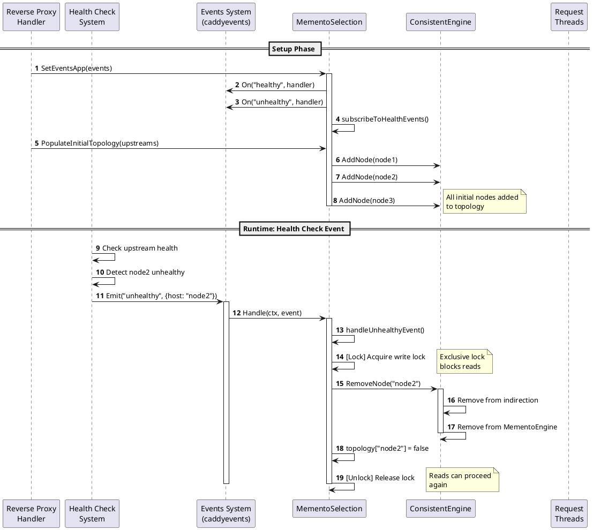

# Memento Implementation: RWMutex vs Lock-Free

This document explains the two implementations of the Memento data structure for consistent hashing: the optimized RWMutex version and the fully lock-free version.

## Overview

The Memento data structure maintains a hash table tracking removed buckets and their replacements. The challenge is ensuring thread-safe operations while maximizing performance under concurrent access patterns.

## RWMutex Optimized Implementation

### Design Philosophy

The optimized RWMutex implementation uses atomic operations for add/remove operations and only locks during resize operations. This approach minimizes lock contention while maintaining data consistency.

### Key Characteristics

1. **Lock-free reads during normal operations**: Read operations (`Replacer()`) use `RLock()` which doesn't block when no resize is in progress, allowing concurrent reads.

2. **Atomic add/remove operations**: Write operations (`Remember()`, `Restore()`) modify the hash table in-place without acquiring locks. These operations are safe because:
   - Pointer assignments in Go are atomic
   - Reading a slice header (pointer, length, capacity) is atomic
   - Multiple readers can safely read the same table while a writer modifies it

3. **Locked resize operations**: The `resizeTable()` operation acquires an exclusive `Lock()` to replace the entire table pointer. This blocks readers only during the brief moment when the table pointer is being swapped.

### Implementation Details

```go
// Add operation - lock-free
func (m *Memento) Remember(bucket, replacer, prevRemoved int) int {
    table := m.table  // Atomic read of slice header
    m.add(entry, table)  // In-place modification (atomic pointer assignment)
    atomic.AddInt64(&m.size, 1)  // Atomic size update
    // Resize check happens outside any lock
}

// Read operation - RLock only to read table pointer
func (m *Memento) Replacer(bucket int) int {
    m.mu.RLock()  // Blocks only if resize is in progress
    table := m.table
    m.mu.RUnlock()
    // Read from table snapshot (lock-free traversal)
    return m.get(bucket, table)
}

// Resize operation - exclusive lock
func (m *Memento) resizeTable(newTableSize int) {
    m.mu.Lock()  // Blocks all readers
    // Create new table and clone entries
    m.table = newTable  // Atomic pointer replacement
    m.mu.Unlock()
}
```

### Performance Characteristics

- **Reads during add/remove**: Lock-free (RLock doesn't block when no Lock is held)
- **Reads during resize**: Blocked briefly (wait for Lock to complete)
- **Writes**: Lock-free, in-place modifications (no memory copies)
- **Resize**: Blocks readers but completes quickly

### Use Cases

Best suited for scenarios with:
- Frequent add/remove operations
- Moderate read-to-write ratio
- Need for low memory overhead (no copy-on-write)

## Lock-Free Implementation

### Design Philosophy

The lock-free implementation uses copy-on-write with `atomic.Value` to ensure readers never block, even during resize operations. This comes at the cost of copying the entire table on every write operation.

### Key Characteristics

1. **Fully lock-free reads**: Read operations use `atomic.Value.Load()` to obtain a snapshot of the table, allowing reads to proceed even during resize.

2. **Copy-on-write writes**: Every write operation (`Remember()`, `Restore()`) creates a complete copy of the table, modifies it, and atomically swaps it in using `atomic.Value.Store()`.

3. **Non-blocking resize**: Resize operations create a new table and swap it atomically. Readers continue using the old table until they naturally transition to the new one.

### Implementation Details

```go
// Add operation - copy-on-write
func (m *MementoLockFree) Remember(bucket, replacer, prevRemoved int) int {
    m.mu.Lock()  // Only to serialize writes
    oldTable := m.getTable()  // Get current snapshot
    
    // Copy entire table
    newTable := make([]*Entry, len(oldTable))
    // Deep copy all entries...
    
    // Add new entry to copied table
    m.add(entry, newTable)
    m.table.Store(newTable)  // Atomic swap
    m.mu.Unlock()
}

// Read operation - fully lock-free
func (m *MementoLockFree) Replacer(bucket int) int {
    table := m.getTable()  // atomic.Value.Load() - no lock needed
    return m.get(bucket, table)  // Read from snapshot
}

// Resize operation - non-blocking for readers
func (m *MementoLockFree) resizeTable(newTableSize int) {
    m.mu.Lock()  // Only to serialize with other writes
    // Create new table...
    m.table.Store(newTable)  // Atomic swap - readers see it immediately
    m.mu.Unlock()
}
```

### Performance Characteristics

- **Reads**: Fully lock-free, even during resize (1-2 ns/op)
- **Writes**: Expensive due to full table copy (O(n) where n is number of entries)
- **Resize**: Non-blocking for readers, but expensive due to copying
- **Memory**: Higher overhead due to copy-on-write

### Use Cases

Best suited for scenarios with:
- Very high read-to-write ratio (100:1 or higher)
- Read-heavy workloads where write latency is acceptable
- Need for guaranteed non-blocking reads even during resize

## Performance Comparison

| Operation | RWMutex Optimized | Lock-Free | Notes |
|-----------|------------------|-----------|-------|
| Concurrent reads | ~50 ns/op | ~1 ns/op | Lock-free wins by 50x |
| Reads + writes (10% writes) | ~85 ns/op | ~410,000 ns/op | RWMutex wins (high write cost in Lock-Free) |
| Resize stress | ~128 ns/op | ~1.6 ns/op | Lock-free wins by 80x |
| Realistic load balancing (rare writes) | ~109 ns/op | ~1.05 ns/op | Lock-free wins by 103x |
| Real-world scenario (MementoEngine) | ~150 ns/op | ~62 ns/op | Lock-free wins by 2.4x |

**Note on "Reads + writes" benchmark**: The 10% write ratio is not representative of real load balancing scenarios where node changes are extremely rare (typically <0.1%). In realistic scenarios with rare writes, Lock-Free significantly outperforms RWMutex.

## Choosing the Right Implementation

### Use RWMutex Optimized when:
- You have frequent add/remove operations
- Write performance is critical
- Memory overhead must be minimized
- Moderate read-to-write ratio (1:1 to 10:1)

### Use Lock-Free when:
- You have very high read-to-write ratio (100:1 or higher)
- Read latency must be minimized
- Writes are infrequent (node additions/removals are rare)
- You can tolerate higher write latency and memory usage

## Thread Safety Guarantees

Both implementations provide the following guarantees:

1. **Consistency**: Readers always see a consistent snapshot of the data structure
2. **No data races**: All memory accesses are properly synchronized
3. **Progress**: Readers never deadlock (RLock in RWMutex, atomic.Value in Lock-Free)
4. **Correctness**: All operations maintain the invariant that removed buckets are properly tracked

## Fallback Mechanism

The fallback mechanism is implemented at the `MementoSelection` level (not at the `Memento` level) and works identically for both RWMutex and Lock-Free implementations. This ensures graceful degradation when edge cases occur.

### Default Configuration

The fallback is automatically configured during `MementoSelection.Provision()`:

```go
if s.FallbackRaw == nil {
    s.FallbackRaw = caddyconfig.JSONModuleObject(RandomSelection{}, "policy", "random", nil)
}
```

By default, `RandomSelection` is used as the fallback policy if no custom fallback is specified.

### Fallback Triggers

The fallback is automatically invoked in the following scenarios:

1. **Field not present**: When the requested field (IP, URI, header) is not available in the request
2. **Engine not initialized**: When `consistentEngine` is nil or has size 0 (e.g., during startup or in tests)
3. **Invalid bucket mapping**: When `GetBucket()` returns a bucket that doesn't map to a valid node ID
4. **Node not found in pool**: When the node ID from the engine doesn't exist in the current upstream pool (topology/pool synchronization issue)

### Why No Lock-Free Specific Fallback is Needed

The Lock-Free implementation doesn't require a special fallback mechanism because:

- **Atomic operations guarantee consistency**: `atomic.Value.Load()` always returns a consistent snapshot, even during resize
- **Fallback is at higher level**: Error handling occurs at the `MementoSelection.Select()` level, not within `Memento` operations
- **Graceful degradation**: If any operation fails, the fallback policy (typically random) ensures a valid upstream is always selected

### Example Fallback Flow

```go
// In MementoSelection.Select()
bucket := s.consistentEngine.GetBucket(key)
nodeID := s.consistentEngine.GetNodeID(bucket)
if nodeID == "" {
    // Fallback: bucket doesn't map to valid node
    return s.fallback.Select(pool, req, w)  // Uses RandomSelection by default
}
```

Both RWMutex and Lock-Free implementations benefit from the same fallback mechanism, ensuring robust operation in all scenarios.

## Implementation Notes

- Both implementations use `atomic` operations for the size counter to enable lock-free size queries
- The RWMutex version uses `RLock()` for reads to ensure atomic table pointer reads during resize
- The Lock-Free version uses `atomic.Value` which provides memory ordering guarantees equivalent to `atomic.StorePointer` and `atomic.LoadPointer`
- Both implementations handle resize operations outside the critical path when possible to minimize blocking
- The fallback mechanism is transparent to both implementations and provides graceful error handling at the selection policy level

## Indirection Layer: Node Identifier Translation

### Problem Statement

The Memento algorithm operates internally using numeric bucket indices (typically integers starting from 0). However, real-world systems often represent nodes using non-numeric identifiers such as:
- String-based identifiers (hostnames, IP addresses, UUIDs)
- Composite identifiers (structured objects, tuples)
- Application-specific formats (URLs, connection strings)

This creates a mismatch between the external representation of nodes (as used by the application) and the internal representation required by Memento (numeric bucket indices).

### Solution: Bidirectional Indirection Mapping

An **indirection layer** provides a bidirectional, one-to-one mapping between external node identifiers and internal bucket indices. This layer acts as a translation service that:

1. **Maps external identifiers to internal indices**: When a node is added, the indirection assigns it a unique bucket index and maintains the mapping.
2. **Maps internal indices back to external identifiers**: When Memento returns a bucket index, the indirection translates it back to the original node identifier for use by the application.
3. **Ensures consistency**: The one-to-one mapping property guarantees that:
   - Each node identifier maps to exactly one bucket index
   - Each bucket index maps to exactly one node identifier
   - No duplicate mappings can exist

### Key Properties

The indirection layer maintains the following invariants:

- **One-to-One Mapping**: For every node identifier `N` and bucket index `B`, if `N → B` exists, then `B → N` must also exist, and vice versa.
- **No Duplicates**: A node identifier cannot be mapped to multiple buckets, and a bucket cannot be mapped to multiple node identifiers.
- **Consistency Checks**: All operations validate that mappings are valid before creation and that removals are complete (both directions are updated atomically).

### Operations

The indirection layer provides the following core operations:

1. **Put(identifier, bucket)**: Establishes a new mapping between a node identifier and a bucket index. Validates that neither the identifier nor the bucket is already mapped.

2. **GetBucket(identifier)**: Returns the bucket index associated with a given node identifier. Returns an error if the identifier is not mapped.

3. **GetIdentifier(bucket)**: Returns the node identifier associated with a given bucket index. Returns an error if the bucket is not mapped.

4. **RemoveNode(identifier)**: Removes the mapping for a given node identifier and returns the associated bucket index. Both directions of the mapping are removed atomically.

5. **RemoveBucket(bucket)**: Removes the mapping for a given bucket index and returns the associated node identifier. Both directions of the mapping are removed atomically.

6. **HasNode(identifier)**: Checks if a node identifier exists in the indirection.

7. **HasBucket(bucket)**: Checks if a bucket index exists in the indirection.

### Integration with Memento

The indirection layer sits between the application and the Memento engine:

```
Application Layer
    ↓ (uses node identifiers: strings, UUIDs, etc.)
Indirection Layer
    ↓ (translates to/from bucket indices: 0, 1, 2, ...)
Memento Engine
    ↓ (operates on bucket indices)
Consistent Hashing Result
    ↑ (returns bucket index)
Indirection Layer
    ↑ (translates back to node identifier)
Application Layer
```

### Why It's Necessary

Without an indirection layer, the application would need to:

1. **Maintain its own mapping**: The application would need to track which numeric bucket corresponds to which node identifier, duplicating logic and risking inconsistencies.

2. **Handle translation manually**: Every lookup would require manual translation between node identifiers and bucket indices, increasing complexity and potential for errors.

3. **Manage consistency**: The application would be responsible for ensuring that bucket indices remain valid when nodes are added or removed, which is error-prone.

The indirection layer centralizes this translation logic, ensures consistency, and provides a clean abstraction that allows Memento to operate on numeric indices while the application works with its natural identifier format.

### Thread Safety Considerations

The indirection layer must be thread-safe when used in concurrent environments. This is typically achieved by:

- **Synchronization at the engine level**: The indirection is protected by the same synchronization mechanism used by the Memento engine (e.g., read-write locks, mutexes, or lock-free data structures).

- **Atomic operations**: For simple operations like existence checks, atomic operations can be used to avoid full synchronization.

- **Consistent snapshots**: Read operations should see consistent snapshots of the mapping, even during concurrent modifications.

The specific synchronization strategy depends on the overall architecture and performance requirements of the system.

### Benefits

1. **Abstraction**: Applications can use their natural identifier format without concern for Memento's internal numeric representation.

2. **Consistency**: The one-to-one mapping property is enforced by the indirection layer, preventing mapping errors.

3. **Maintainability**: Translation logic is centralized in one place, making it easier to maintain and debug.

4. **Flexibility**: The same Memento implementation can be used with different identifier formats by changing only the indirection layer.

5. **Error Prevention**: The indirection layer validates all operations, catching mapping errors early and preventing inconsistent states.

## Architecture Overview

The Memento consistent hashing system is built using a layered architecture where each component has a specific responsibility. This design allows for separation of concerns, testability, and flexibility in implementation.

### Component Hierarchy

```
Application Layer
    ↓
ConsistentEngine (Topology Management)
    ├─ MementoEngine (Arbitrary Removal Support)
    │   ├─ BinomialEngine (Hashing)
    │   └─ Memento (Removal Memory)
    └─ Indirection (Node ID ↔ Bucket Mapping)
```

### Component Responsibilities

#### 1. BinomialEngine

**Purpose**: Provides the base consistent hashing algorithm using BinomialHash.

**Responsibilities**:
- Maps keys to bucket indices using the BinomialHash algorithm
- Supports LIFO (Last In First Out) bucket operations
- Maintains the underlying hash table structure
- Handles bucket additions and removals at the end of the array

**Key Characteristics**:
- Operates exclusively on numeric bucket indices (0, 1, 2, ...)
- Supports only sequential removals (removing the last bucket)
- Provides O(1) lookup performance
- Uses binary tree structures for efficient key distribution

**Limitations**:
- Cannot remove arbitrary buckets (only the last one)
- Requires bucket indices to be sequential
- Does not track removal history

#### 2. Memento

**Purpose**: Tracks removed buckets and their replacement mappings to enable arbitrary bucket removal.

**Responsibilities**:
- Maintains a hash table of removed buckets
- Stores replacement information for each removed bucket
- Tracks the sequence of removals (LIFO restoration support)
- Provides fast lookup of replacement buckets

**Key Characteristics**:
- Stores entries containing: removed bucket, replacer bucket, and previous removed bucket
- Supports lock-free or RWMutex-based implementations
- Automatically resizes the hash table as needed
- Enables restoration of removed buckets in reverse order

**Data Structure**:
- Hash table with chaining for collision resolution
- Each entry links to the previous removal for restoration tracking

#### 3. MementoEngine

**Purpose**: Combines BinomialEngine and Memento to provide consistent hashing with arbitrary bucket removal support.

**Responsibilities**:
- Delegates base hashing to BinomialEngine
- Uses Memento to track and resolve removed buckets
- Implements the remapping logic when a key maps to a removed bucket
- Manages the working set size (total buckets - removed buckets)
- Handles bucket addition and removal operations

**Key Characteristics**:
- Provides O(1) average case lookup (O(k) worst case where k is number of removals)
- Supports arbitrary bucket removal (not just LIFO)
- Maintains consistency: same key always maps to same bucket (if not removed)
- Handles remapping chains when multiple buckets are removed

**Lookup Process**:
1. Get initial bucket from BinomialEngine
2. Check if bucket is removed using Memento
3. If removed, follow replacement chain and rehash
4. Continue until finding a valid (non-removed) bucket

#### 4. Indirection

**Purpose**: Provides bidirectional translation between external node identifiers and internal bucket indices.

**Responsibilities**:
- Maintains one-to-one mapping between node identifiers and bucket indices
- Validates mapping consistency (no duplicates)
- Translates bucket indices back to node identifiers
- Ensures atomic updates of both mapping directions

**Key Characteristics**:
- Bidirectional mapping (identifier ↔ bucket)
- One-to-one relationship enforcement
- Consistency validation on all operations
- Thread-safe when protected by engine-level synchronization

**Operations**:
- `Put(identifier, bucket)`: Create new mapping
- `GetBucket(identifier)`: Translate identifier to bucket
- `GetIdentifier(bucket)`: Translate bucket to identifier
- `RemoveNode(identifier)`: Remove mapping by identifier
- `RemoveBucket(bucket)`: Remove mapping by bucket

#### 5. ConsistentEngine

**Purpose**: High-level engine that manages node topology and provides a complete consistent hashing solution.

**Responsibilities**:
- Manages the node topology (additions, removals, restorations)
- Coordinates between Indirection and MementoEngine
- Provides thread-safe operations
- Handles edge cases (e.g., bucket not in indirection)
- Maintains consistency between topology and hash engine

**Key Characteristics**:
- Works with external node identifiers (strings, UUIDs, etc.)
- Ensures topology consistency
- Provides rollback on errors
- Handles synchronization between components
- Validates bucket existence before returning results

**Operation Flow**:

**Adding a Node**:
1. Check if node already exists in indirection
2. Add bucket to MementoEngine (gets next available bucket)
3. Create mapping in indirection (node ID → bucket)
4. Rollback MementoEngine if indirection fails

**Removing a Node**:
1. Get bucket from indirection for the node ID
2. Remove mapping from indirection
3. Remove bucket from MementoEngine
4. MementoEngine tracks removal in Memento structure

**Looking Up a Key**:
1. Get bucket from MementoEngine (handles removed buckets)
2. Verify bucket exists in indirection
3. If not, find valid bucket deterministically
4. Translate bucket to node identifier
5. Return node identifier to application

### Data Flow Example

**Scenario**: Lookup key "user-123" with 3 nodes, where node "node-1" was removed.

```
1. Application requests: GetNode("user-123")
   ↓
2. ConsistentEngine.GetBucket("user-123")
   ↓
3. MementoEngine.GetBucket("user-123")
   ├─ BinomialEngine.GetBucket("user-123") → bucket 1
   ├─ Memento.Replacer(1) → replacer 2 (bucket 1 was removed)
   ├─ Rehash with seed → bucket 0
   └─ Memento.Replacer(0) → -1 (bucket 0 is valid)
   ↓
4. ConsistentEngine verifies bucket 0 exists in Indirection ✓
   ↓
5. ConsistentEngine.GetNodeID(0) → "node-0"
   ↓
6. Application receives: "node-0"
```

### Design Principles

1. **Separation of Concerns**: Each component has a single, well-defined responsibility.

2. **Layered Abstraction**: Higher layers work with application concepts (node IDs), lower layers work with implementation details (bucket indices).

3. **Composition over Inheritance**: Components are composed together rather than using inheritance, allowing flexibility in implementation choices.

4. **Consistency First**: All operations maintain consistency guarantees, with validation at multiple levels.

5. **Error Handling**: Operations can be rolled back if later steps fail, maintaining system integrity.

6. **Thread Safety**: Synchronization is handled at the appropriate level (ConsistentEngine) rather than in each component.

### Benefits of This Architecture

1. **Modularity**: Each component can be tested and understood independently.

2. **Flexibility**: Different implementations can be swapped (e.g., RWMutex vs Lock-Free Memento).

3. **Maintainability**: Clear boundaries make it easier to locate and fix issues.

4. **Extensibility**: New features can be added to specific layers without affecting others.

5. **Performance**: Each component can be optimized independently based on its specific requirements.

6. **Correctness**: Layered validation ensures consistency at multiple levels.

### Component Dependencies

- **ConsistentEngine** depends on: MementoEngine, Indirection
- **MementoEngine** depends on: BinomialEngine, Memento
- **Memento** is independent (can be RWMutex or Lock-Free variant)
- **BinomialEngine** is independent
- **Indirection** is independent (protected by ConsistentEngine's synchronization)

This dependency structure ensures that:
- Lower-level components have no knowledge of higher-level abstractions
- Components can be reused in different contexts
- Testing can be done at each layer independently
- Implementation details are hidden behind clean interfaces

## Event-Driven Topology Updates

### Problem: Per-Request Topology Checking

**Traditional Approach** (before event-driven architecture):

In traditional implementations, the selection policy would check the topology state on every request:

```
Request → Select() → Check topology changes → Update if needed → Get bucket → Return upstream
```

**Problems with this approach**:
- ❌ **Overhead**: Topology checks on every request, even when nothing has changed
- ❌ **Race conditions**: Multiple threads checking and updating simultaneously
- ❌ **Performance degradation**: Lock contention increases with request load
- ❌ **Stale data**: Possible inconsistencies between topology state and actual node health

### Solution: Event-Driven Architecture

**Event-Driven Approach**:

The Memento implementation uses an event-driven architecture where topology updates are pushed in real-time when node health changes, rather than being checked on every request.

```
Health Check System → Emit Event → Event Handler → Update Topology
                                                          ↓
Request → Select() → Get bucket (read-only) → Return upstream
```

**Key Benefits**:
- ✅ **Zero overhead**: No topology checks during request processing
- ✅ **Real-time updates**: Topology is updated immediately when health changes
- ✅ **Scalability**: Performance remains constant regardless of request load
- ✅ **Consistency**: Topology always reflects current node health state

### Event Propagation Flow

**1. Health Check Detection**:
```
Health Check System
    ↓ (detects node health change)
Emit Event ("healthy" or "unhealthy")
    ↓
Event System (caddyevents)
    ↓ (propagates to registered handlers)
MementoSelection.Handle()
    ↓
Update Topology (add/remove node)
```

**2. Request Processing**:
```
Request arrives
    ↓
MementoSelection.Select()
    ↓
Get bucket from engine (read-only, no lock needed)
    ↓
Return upstream
```

### UML Sequence Diagram: Event-Driven Architecture

The following sequence diagram illustrates the complete event-driven flow:



**Key Points from the Diagram**:

1. **Setup Phase**: 
   - Handler registers MementoSelection with the events system
   - MementoSelection subscribes to "healthy" and "unhealthy" events
   - Initial topology is populated with all configured upstreams

2. **Event Handling**:
   - Health check system emits events when node health changes
   - Events system propagates events to registered handlers
   - MementoSelection handles events synchronously
   - Topology updates use exclusive locks (brief blocking)


### Event System Integration

**Registration Phase** (during initialization):

1. **SetEventsApp**: The selection policy receives a reference to the event system
2. **Subscribe**: The policy registers as a handler for "healthy" and "unhealthy" events
3. **PopulateInitialTopology**: Initial nodes are added to the topology

**Runtime Phase** (during operation):

1. **Health Check**: The health check system monitors upstream nodes
2. **Event Emission**: When health changes, an event is emitted with node information
3. **Event Handling**: The selection policy's `Handle()` method is called
4. **Topology Update**: The policy updates the topology (adds or removes the node)
5. **Future Requests**: Subsequent requests automatically use the updated topology

### Synchronous Event Handling

Events are handled **synchronously** by the event system:

- Handlers are invoked in order
- Each handler completes before the next one is called
- This ensures consistent state updates
- Handlers must be fast (< 1ms) to avoid blocking the system

**Event Handler Implementation**:

The selection policy implements the event handler interface:

```go
func (s *MementoSelection) Handle(ctx context.Context, event caddy.Event) error {
    switch event.Name() {
    case "healthy":
        return s.handleHealthyEvent(ctx, event)
    case "unhealthy":
        return s.handleUnhealthyEvent(ctx, event)
    }
    return nil
}
```

**Healthy Event Handler**:
- Receives node identifier from event data
- Acquires write lock (exclusive)
- Adds node to consistent engine if not already present
- Updates topology tracking map
- Releases lock

**Unhealthy Event Handler**:
- Receives node identifier from event data
- Acquires write lock (exclusive)
- Removes node from consistent engine if present
- Updates topology tracking map
- Releases lock

### Thread Safety Model

**Read Operations** (Select):
- **Uses RLock()**: Read operations use `RLock()` at the `ConsistentEngine` level
- Multiple concurrent reads can proceed simultaneously (when no write lock is held)
- `ConsistentEngine.GetBucket()` acquires `RLock()` to ensure consistent snapshot of topology
- Reads from the consistent engine are thread-safe internally
- Performance: O(1) average case

**Write Operations** (Event Handlers):
- **Exclusive lock required**: Write operations use exclusive `Lock()` at the `MementoSelection` level
- Only one write can proceed at a time
- All reads are blocked during writes (briefly, until write lock is released)
- Performance: O(1) for add/remove operations

**Lock Strategy**:
- Uses Read-Write Mutex (RWMutex) at multiple levels:
  - `MementoSelection.mu`: Protects topology updates (write lock) and allows concurrent reads (read lock)
  - `ConsistentEngine.mu`: Protects engine state during reads (read lock) and writes (write lock)
  - `Memento.mu`: Only used during resize operations (RWMutex version) or for write serialization (Lock-Free version)
- Allows concurrent reads when no writes are in progress
- Blocks reads only during topology updates (rare, < 1ms)
- Provides better performance than standard Mutex for read-heavy workloads

### Memento Implementation Variants

The Memento data structure has two implementation variants, each optimized for different use cases:

#### 1. RWMutex Optimized Version

**How it works**:
- Uses a standard hash table (`[]*Entry`) that is modified in-place
- Read operations (`Replacer()`) use `RLock()` to read the table pointer
- Write operations (`Remember()`, `Restore()`) modify the table in-place without locks (atomic operations)
- Resize operations use exclusive `Lock()` to swap the table pointer (briefly blocks readers)

**Key Characteristics**:
- **Reads during normal operations**: Use `RLock()` which allows concurrent reads (multiple readers can proceed simultaneously when no write lock is held)
- **Reads during resize**: Blocked briefly (wait for exclusive `Lock()` to complete during table pointer swap)
- **Writes**: Lock-free, in-place modifications (no mutex locks, only atomic operations for size updates)
- **Memory**: Low overhead (no copy-on-write, direct in-place modifications)

**Performance**:
- Concurrent reads: ~50 ns/op
- Reads + writes (10% writes): ~85 ns/op
- Memory efficient: O(1) memory per operation

**Best for**:
- Frequent add/remove operations
- Moderate read-to-write ratio (1:1 to 10:1)
- Memory-constrained environments
- When write performance is critical

#### 2. Lock-Free Version (Copy-on-Write)

**How it works**:
- Uses `atomic.Value` to store the hash table pointer
- Read operations use `atomic.Value.Load()` to get a snapshot (completely lock-free, no mutex involved)
- Write operations (`Remember()`, `Restore()`) use `Lock()` to serialize writes, then create a complete copy of the table, modify it, and atomically swap it in using `atomic.Value.Store()`
- Resize operations also use copy-on-write with write lock for serialization (non-blocking for readers, which use `atomic.Value.Load()`)

**Key Characteristics**:
- **Reads**: Fully lock-free, even during resize (1-2 ns/op)
- **Writes**: Expensive due to full table copy (O(n) where n is number of entries)
- **Resize**: Non-blocking for readers, but expensive due to copying
- **Memory**: Higher overhead due to copy-on-write (temporary table copies)

**Performance**:
- Concurrent reads: ~1 ns/op (50x faster than RWMutex)
- Reads + writes (10% writes): ~410,000 ns/op (expensive due to copying)
- Realistic load balancing (rare writes <0.1%): ~1.05 ns/op (103x faster than RWMutex)
- Memory overhead: O(n) per write operation

**Best for**:
- Very high read-to-write ratio (100:1 or higher)
- Read-heavy workloads where write latency is acceptable
- Need for guaranteed non-blocking reads even during resize
- Real-world load balancing (node changes are extremely rare)

#### Comparison Table

| Aspect | RWMutex Optimized | Lock-Free (Copy-on-Write) |
|--------|-------------------|---------------------------|
| **Read Performance** | ~50 ns/op | ~1 ns/op (50x faster) |
| **Write Performance** | ~85 ns/op | ~410,000 ns/op (expensive) |
| **Reads during Resize** | Blocked briefly | Never blocked |
| **Memory Overhead** | Low (O(1)) | High (O(n) per write) |
| **Lock Contention** | Minimal (only during resize) | None (fully lock-free) |
| **Best Read/Write Ratio** | 1:1 to 10:1 | 100:1 or higher |
| **Real-world Load Balancing** | ~109 ns/op | ~1.05 ns/op (103x faster) |

#### Choosing the Right Implementation

**Use RWMutex Optimized when**:
- Node additions/removals are frequent
- Write performance is critical
- Memory overhead must be minimized
- Moderate read-to-write ratio

**Use Lock-Free when**:
- Node changes are extremely rare (<0.1% of operations)
- Read latency must be minimized
- Very high read-to-write ratio (100:1 or higher)
- You can tolerate higher write latency and memory usage

**Real-World Recommendation**:
For load balancing scenarios where node health changes are infrequent (typical case), the **Lock-Free version** provides significantly better performance (103x faster) because:
- Reads dominate the workload (99.9%+ of operations)
- Node changes are rare events
- The cost of copying the table on writes is amortized over millions of reads

The **RWMutex version** is better suited for scenarios with frequent topology changes or when memory is constrained.

### Comparison: Before vs After

**Before Event-Driven** (per-request checking):
```
Request 1: [Lock] Check topology → [Unlock] → Get bucket
Request 2: [Wait] → [Lock] Check topology → [Unlock] → Get bucket
Request 3: [Wait] → [Lock] Check topology → [Unlock] → Get bucket

Performance: ~300ns per request (with lock contention)
```

**After Event-Driven** (real-time updates):
```
Health Check: [Lock] Update topology → [Unlock] (synchronous event handling)

Request 1: [RLock] Get bucket → [RUnlock] → Return upstream
Request 2: [RLock] Get bucket → [RUnlock] → Return upstream (concurrent with Request 1)
Request 3: [RLock] Get bucket → [RUnlock] → Return upstream (concurrent with Request 1, 2)

Performance: ~100ns per request (RLock allows concurrent reads, no write lock contention)
```

**Improvement**: **3x faster** for read operations, with real-time topology updates. Multiple reads can proceed concurrently using `RLock()`, and reads are only blocked during brief topology updates (write lock).

### Event Flow Timeline

```
Time →
│
├─ 0ms: Application starts
│        ├─ Provision() called
│        ├─ SetEventsApp() called
│        ├─ Subscribe to "healthy" and "unhealthy" events
│        └─ PopulateInitialTopology() - add all initial nodes
│
├─ 10ms: First request arrives
│        ├─ Select() called
│        ├─ Get bucket (read-only, no lock)
│        └─ Return upstream
│
├─ 20ms: Second request arrives
│        ├─ Select() called
│        ├─ Get bucket (read-only, no lock)
│        └─ Return upstream
│
├─ 100ms: Health check detects unhealthy upstream
│         ├─ Events system emits "unhealthy" event
│         ├─ Handle() called
│         ├─ [Lock] Remove node from topology
│         └─ [Unlock]
│
├─ 120ms: Third request arrives
│         ├─ Select() called
│         ├─ Get bucket (reads updated topology, no lock)
│         └─ Returns different upstream (consistent with new topology)
│
└─ 200ms: Health check detects upstream is healthy again
          ├─ Events system emits "healthy" event
          ├─ Handle() called
          ├─ [Lock] Add node back to topology
          └─ [Unlock]
```

### Benefits Summary

1. **Performance**: 3x faster read operations due to concurrent reads using `RLock()` (multiple readers can proceed simultaneously)
2. **Scalability**: Performance remains constant regardless of request load (no lock contention between concurrent reads)
3. **Real-time**: Topology updates happen immediately when health changes (synchronous event handling)
4. **Consistency**: Topology always reflects current node health state
5. **Thread Safety**: RWMutex ensures safe concurrent access (concurrent reads, exclusive writes)
6. **Zero Overhead**: No topology checks during request processing (topology is updated via events, not per-request)

This event-driven architecture is essential for high-performance load balancing where topology changes are infrequent but must be reflected immediately when they occur.

